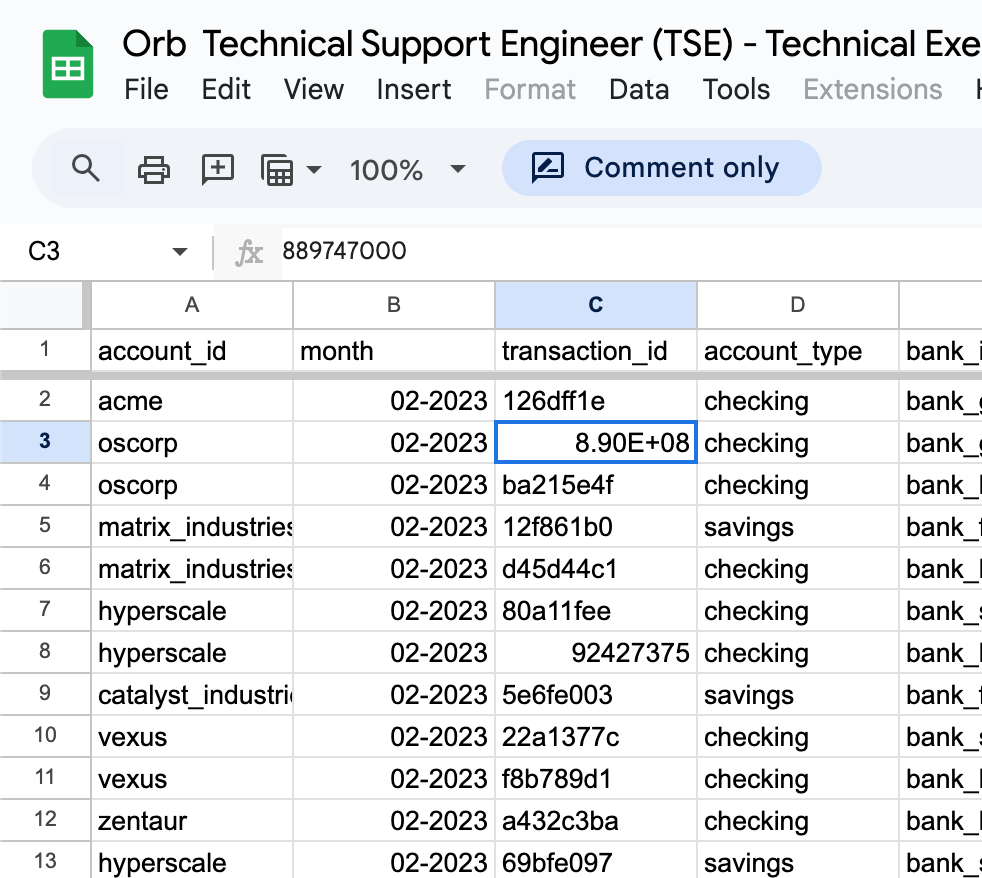
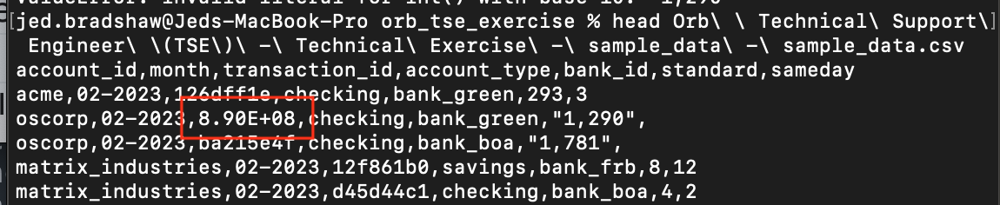

## Usage

```python orb_script.py filename.csv```


The input file parameter (`filename.csv`) is required.

`.env` should live in the project directory and should contain the variable `ORB_API_KEY` with a valid value.

## Note on Input Data

For my submission, I made a minor modification to the input data. This is because the Google Sheet contains an engineering-notation-formatted value in cell C3:


Which gets carried over into the CSV when exported:


The value of C3 in the sheet is 889747000. I note that this is a nine-digit hex value whereas all the other `transaction_id`s are eight-digit hex values, so I assumed an error and corrected the value to 88974700.

I mention all this to explain possible result discrepancies when running from your own source CSV and for correction for future interview candidates if indeed an error was made.


## Assumptions

* Input file is a (valid) CSV
* I have chosen the value `transaction_processed` for `event_name`, as that is a required field. There might be a better label for this data set, and I would clarify that with the requester prior to ingestion.
* `timestamp` is not included in the data and so is set to current time. This is not ideal but appropriate for the problem statement, as we're entering data from the current billing period. Backfilling would require a different solution.
* Additional datasets will contain the same headers as this one. (Additional fields will not cause a failure, but new fields will not be ingested.)
* Additional data fields will roughly match data format as provided (e.g. columns F and G will continue to be cast-able to integers and not alphabetical strings).
* Required fields will not be empty. (Orb API validation will catch this)
* I have chosen to interpret blank values in F and G as `False`. I could have interpreted them as empty strings or 0s but I believe `False` is better for metric filtering than the empty string and that some meaning is preserved in differentiating between null and zero values.
* I have set the batch size to 500 per the limitation described [here](https://docs.withorb.com/guides/events-and-metrics/event-ingestion#event-volume-and-concurrency). I'm not sure whether this limitation is done server-side so I implemented it client-side to be safe.

## Potential Improvements
* I could do format validation on the incoming CSV header. This would mean changes are required to the script to handle new fields, but would ensure new fields get ingested.

* I could change `parse_to_int()` to handle floats/decimals if appropriate.

* I could implement the `event_list` as a generator rather than a list for freeing up memory in the event of very large input files.

* Though retries should be covered for retry-able requests by default, I could improve error handling and reporting around Orb API functions. At present errors should be clearly visible and actionable to user, but could handle them more gracefully.

* Could include dry-run command-line option to print output data for user review without submitting.

* Could retrieve API response info to avoid re-submitting data if changes are needed. (Example: Validation error occurs for one item, all others go through successfully. After the data are corrected, this info could be used to only submit failed entry (even though idempotent resubmission will be safe).)